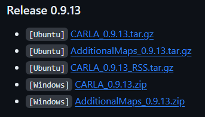

# Carla-Simulator-Project-ACC-LKA-LFC-

# Carla-Simulink (ACC-LKA HIL Testing)

- [Carla-Simulink (ACC-LKA HIL Testing)](#carla-simulink-acc-lka-hil-testing)
  - [General Note](#general-note)
  - [Before You Start!!](#before-you-start)
  - [Requirements](#requirements)
    - [Hardware](#hardware)
    - [Software](#software)
  - [Getting Started](#getting-started)
    - [Virtual environment?](#virtual-environment)
    - [Using the Python Interface whithin Matlab](#using-the-python-interface-whithin-matlab)
      - [Things to keep in mind](#things-to-keep-in-mind)
  - [HIL Testing](#hil-testing)
  - [Getting ScenarioRunner to work](#getting-scenariorunner-to-work)


## General Note

This repository was made under an academic project for the End of Semester Project at the National School of Applied Sciences of Fez, Morocco. The project was supervised by `Dr. Anass Mansouri` and was made by `Ghourdou Mouad` `Abdelhadi Elghazi` `Zaim Oussama` `Lakouti Hamza`, this repository also serves as a reference for the project report and a guide for future students who will be working on the same project.

This README file is gonna contain the necessary steps and possible scenarios/issues that might occur while working on the project.

## Before You Start!!

Now we got the formalities out of the way, let's get to the fun part. Before you start working on the project, I want you to adopt the following practices (**these are more like tips and not actual rules**):

 - Work within a `virtual environment`, this will help you avoid conflicts between dependecies and make it easier to go back and start from scratch without loosing progress.
 - Use different `Carla versions` for testing, in my case, I worked with both version `0.9.13` (**the one that I was ordered to use**) and version `0.9.5` the version I prefered using, because it had lesser load on my PC and was basically the same for what the project needed. **Keep in mind that some features may not exist in older versions or may not work well in that version**.
 - If possible, and especially if you're working whithin a team, try to work with [Carla in a Docker container](https://carla.readthedocs.io/en/latest/build_docker/#running-carla-in-a-container), in my case, the team didn't have the time to actually do it, but looking back, it would've saved us a lot of time and effort, due to a lot of dependency issues that we had to deal with.

These are the main points that I wanted to mention, now let's get to the actual project.
Keep in mind, there will be additional notes and tips throughout the README file, so make sure to read it carefully.
   
## Requirements

### Hardware

To run this interface, the following requirements should be met.

As Carla uses [Unreal Engine](https://www.unrealengine.com), the recommended requirements are basically the same, which are as follows.

- 64-bit Windows/Linux/MacOS
- 8-GB RAM or more
- Quad core Intel or AMD processor, 2.5 GHz or faster
- NVIDIA GeForce 470 GTX or AMD Radeon 6870 HD series card or higher
- 10GB of hard drive space for the simulator setup

### Software

Now for the software requirements, you will need the following:

- [Carla 0.9.13](https://github.com/carla-simulator/carla/releases/tag/0.9.13)  Documentation for this version can be found [here](https://carla.readthedocs.io/en/0.9.13/).
- `Matlab R2021a` is the one that we used, you can use newer versions, but I can't guarantee that it will work. we found that the `Python Engine` in Matlab R2021a is more stable so I recommend using R2021a.
- Make sure that the version `Python 3.7`, is the one you're running on your machine or virtual environment.

Below I will share with you every dependency with their version in case you run into any compatibility issues. 

```console
Python                3.7.9
pip                   20.1.1
ansi2html             1.8.0
attrs                 23.1.0
backcall              0.2.0
carla                 0.9.13
certifi               2023.7.22
charset-normalizer    3.3.1
click                 8.1.7
colorama              0.4.6
comm                  0.1.4
ConfigArgParse        1.7
cycler                0.11.0
dash                  2.14.0
dash-core-components  2.0.0
dash-html-components  2.0.0
dash-table            5.0.0
debugpy               1.7.0
decorator             5.1.1
elementpath           1.3.3
entrypoints           0.4
ephem                 4.1.5
fastjsonschema        2.18.1
Flask                 2.2.5
fonttools             4.38.0
idna                  3.4
importlib-metadata    6.7.0
importlib-resources   5.12.0
ipykernel             6.16.2
ipython               7.34.0
ipywidgets            8.1.1
itsdangerous          2.1.2
jedi                  0.19.1
Jinja2                3.1.2
jsonschema            4.17.3
jupyter-client        7.4.9
jupyter-core          4.12.0
jupyterlab-widgets    3.0.9
kiwisolver            1.4.5
MarkupSafe            2.1.3
matplotlib            3.5.3
matplotlib-inline     0.1.6
nbformat              5.7.0
nest-asyncio          1.5.8
networkx              2.2
numpy                 1.21.6
open3d                0.17.0
opencv-python         4.2.0.32
packaging             23.2
parso                 0.8.3
pickleshare           0.7.5
Pillow                9.5.0
pip                   20.1.1
pkgutil-resolve-name  1.3.10
plotly                5.18.0
prompt-toolkit        3.0.39
psutil                5.9.6
py-trees              0.8.3
pydot                 2.0.0
pygame                2.5.2
Pygments              2.16.1
pyparsing             3.1.1
pyrsistent            0.19.3
python-dateutil       2.8.2
pywin32               306
pyzmq                 25.1.1
requests              2.31.0
retrying              1.3.4
setuptools            47.1.0
Shapely               1.7.1
simple-watchdog-timer 0.1.1
six                   1.16.0
tabulate              0.9.0
tenacity              8.2.3
tornado               6.2
traitlets             5.9.0
typing-extensions     4.7.1
urllib3               2.0.7
wcwidth               0.2.8
Werkzeug              2.2.3
widgetsnbextension    4.0.9
xmlschema             1.0.18
zipp                  3.15.0 
```

## Getting Started

Now I'll assume you already have the `Carla zip file` extracted and open the terminal under inside the folder `PythonAPI/carla/dist`, to install carla, you need to first run this command in your terminal:

```console
pip install setuptools
```
and then run this command:

```console
easy_install carla-0.9.13-py3.7-win-amd64.egg
```

`Note`: the name of the egg file may differ depending on your OS and Python version.

`Note2`: you may have to run the terminal as an administrator (sudo/admin).

`Note3`: if you're using a virtual environment, make sure to activate it before running the commands.

### Virtual environment?

In case you don't have anaconda installed, you can use the following commands to :

Create your virtual environment:

```console
python -m venv /path/to/new/virtual/environment

```
Activate your virtual environment:

```console
cd /path/to/new/virtual/environment/Scripts
```
then run the following command:

```console
./activate
```

Now you've successfully created and activated your virtual environment.

I advise you to create the environment whithin the Carla folder, so you can easily access it. and to make sure you dont mix it up with other virtual environments that may be for other carla versions. 

`Note`: if you need a different version of python on your machine, you can easily manage between the virtual environments using the `conda` command (anaconda).


### Using the Python Interface whithin Matlab

Now that you have successfully installed Carla, you can now run the examples that are provided in the `PythonAPI/examples` folder or you can start writing your own scripts :)

**If the python scripts are working, that means you have made it through the first step, which is getting carla to work on your machine, if not, try to check the dependecies above.**

**Now you go through the second step, which is using the python interface whithin Matlab.**

I will provide you with a Github repository that contains all the scripts and guidance that I used to get familiarized with carla for the project, you can find it [here](https://github.com/darkscyla/MATLAB-Carla-Interface/blob/master/README.md#writing-your-first-matlab-script-for-carla-using-the-python-interface)

I also recommend that you read the documentation for the carla version that you're running, you may find it [here](https://carla.readthedocs.io/en/latest/python_api/).

#### Things to keep in mind

In case you have ran into some problems, you may check these following points:

(**in case you're using a virtual environment**)
- Make sure you have launched carla after activating the virtual environment. 
```console
  (name of the virt_env)  ./CarlaUE4
  ```
- Make sure you have launched Matlab after  activating the virtual environment.
```console
  (name of the virt_env)  ./MATLAB.exe
  ```
your terminal should look something like the above once you activated the environment.

- Check the dependencies above and make sure you have installed them correctly, `You may need to install other dependencies based on your machine`.

## HIL Testing
This project contains also a HIL testing part, which is basically a Simulink model that contains the ACC and LKA controllers, and the Carla interface, this model is used to test the controllers in a simulated environment, and to make sure that they are working as intended.

The steps that I followed to get it the raspberry to work with matlab are as follows:
- First, I installed the `Raspberry Pi Support Package` for Matlab, you can find the installation guide [here](https://www.mathworks.com/help/supportpkg/raspberrypiio/ug/install-raspberry-pi-hardware-support.html)
- Then, I installed the `Simulink Support Package for Raspberry Pi Hardware`, you can find the installation guide [here](https://www.mathworks.com/help/supportpkg/raspberrypiio/ug/install-simulink-support-package-for-raspberry-pi-hardware.html)
- Then I had to install an image that is suitable with MATLAB R2021a (you can accomplish that by using two methods):
    - Get the image from Mathworks themselves, following the guide they have on their `Raspberry Pi Support Package`.
    - Modify your already existing OS image and install the dependencies they mention in their guide.

I used the second method, because I already had an image that I was using for the project, and I didn't want to start from scratch.
Plus I had some issues with the first method, so I decided to go with the second one.

The model is located under the `HIL` folder, and it contains the following files:
`ACC_Build_Comp.slx`
`Carla_Env.slx`


`Note` I used a UDP connection to communicate between the simulink model and the raspberry pi, so you may need to change the IP address and the port number based on your network configuration. 

`Note2` Make sure to configure the step-time in the simulink model, based on your needs, for example i had carla and simulink synced at 0.01s.

## Getting ScenarioRunner to work

Another aspect of our project was to use the ScenarioRunner module to create scenarios for Carla, this module is used to create scenarios for testing the autonomous vehicles, it is also used to create scenarios for the HIL testing.

Unfortunately, we didn't have the time to actually make different scenarios, but I will provide you with the necessary steps to get it to work.

first, you'll have to download the zip file that contains the ScenarioRunner module, you can find it [here](https://github.com/carla-simulator/scenario_runner)

once you've downloaded it and extracted it, you'll have to install the dependencies, you can find them under the `requirements.txt` file found under the extracted folder, you can install them using the following command:

```console
pip3 install --user -r requirements.txt
```
`Note`: you need to remove the old version of networkx, because it may cause some conflicts.

```console
sudo apt remove python3-networkx
```
These are the dependencies that I used to get it to work (all of which are above)
```console
py-trees==0.8.3
networkx==2.2
Shapely==1.7.1
psutil
xmlschema==1.0.18
ephem
tabulate
opencv-python==4.2.0.32
numpy
matplotlib
six
simple-watchdog-timer
```

After installing the dependencies, you can now run the following command to launch the ScenarioRunner module:

```console
$env:CARLA_ROOT = \path\to\your\carla\installation
$env:SCENARIO_RUNNER_ROOT = \path\to\your\scenario\runner\installation
$env:PYTHONPATH = %PYTHONPATH%;%CARLA_ROOT%\PythonAPI\carla\dist\carla-<VERSION>.egg
$env:PYTHONPATH = %PYTHONPATH%;%CARLA_ROOT%\PythonAPI\carla
```

`Note`: One important Note that I wanna share is that these commands are for Windows, and are `!TEMPORARY!`, which means you'll be doing this everytime you want to work with scnario runner, so I recommend that you create a `.bat` file that contains these commands and run it everytime you want to work with scenario runner.
or create a environment variable, search env in the windows search, under `Edit the system environment variables` click on `Environment Variables` and create a new variable with the name `CARLA_ROOT` and the value is the path to your carla installation, and do the same for `SCENARIO_RUNNER_ROOT` and `PYTHONPATH`.

`Note2`: if you are on powershell, use this instead:

```console
set CARLA_ROOT=\path\to\your\carla\installation
```

`Note3`: Try not to use relative Paths, use absolute paths instead. 

